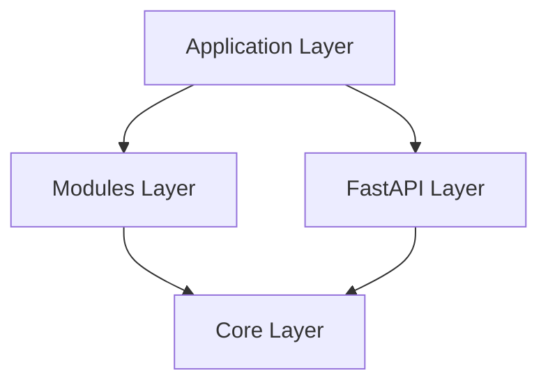

# Architecture

Chapkit follows a **vertical slice architecture** that separates concerns while keeping related code together.

## Overview

```
chapkit/
├── core/                 # Framework-agnostic infrastructure
│   ├── database.py      # Database, migrations
│   ├── models.py        # Base, Entity ORM classes
│   ├── repository.py    # Repository, BaseRepository
│   ├── manager.py       # Manager, BaseManager
│   ├── schemas.py       # EntityIn, EntityOut, PaginatedResponse
│   ├── scheduler.py     # JobScheduler
│   ├── exceptions.py    # Error classes
│   └── api/             # FastAPI framework layer
│       ├── router.py    # Router base class
│       ├── crud.py      # CrudRouter
│       └── dependencies.py
├── modules/             # Domain modules (vertical slices)
│   ├── config/         # Key-value config with JSON data
│   ├── artifact/       # Hierarchical artifact trees
│   ├── task/           # Script execution templates
│   └── ml/             # ML train/predict operations
└── api/                # Application orchestration
    └── service_builder.py   # ServiceBuilder (app factory)
```

## Layers

### 1. Core Layer

The **core layer** is framework-agnostic and contains:

- Database management and migrations
- Base entity models
- Repository pattern (data access)
- Manager pattern (business logic)
- Schemas for validation
- Job scheduling

Learn more: [Core Layer](core-layer.md)

### 2. API Layer

The **API layer** integrates FastAPI:

- Router base classes
- CRUD router with automatic endpoints
- Middleware and error handlers
- Dependencies for DI
- Health checks and system info

Learn more: [API Layer](api-layer.md)

### 3. Modules

**Modules** are complete vertical slices with:

- Models (ORM)
- Schemas (Pydantic)
- Repository (data access)
- Manager (business logic)
- Router (HTTP endpoints)

Each module is self-contained and independently testable.

Learn more: [Modules](modules.md)

### 4. Application Layer

The **application layer** orchestrates modules:

- ServiceBuilder for composition
- Dependencies for module managers
- Application lifecycle management

## Dependency Flow



**Rules:**

- Core never imports from modules or application
- Modules may import from core but not from application
- Application imports from both core and modules
- FastAPI layer is part of core

Learn more: [Dependency Flow](dependency-flow.md)

## Design Principles

### 1. Framework Agnostic Core

The core layer doesn't depend on FastAPI. This allows:

- Using core components in non-web applications
- Testing business logic without HTTP
- Swapping web frameworks if needed

### 2. Vertical Slices

Each module contains everything needed for a feature:

- Database models
- API schemas
- Business logic
- HTTP routes

This keeps related code together and makes features independently deployable.

### 3. Composition Over Configuration

ServiceBuilder uses method chaining for clarity:

```python
app = (
    ServiceBuilder(info=info)
    .with_health()
    .with_config(MyConfig)
    .with_artifacts(hierarchy)
    .build()
)
```

Each method adds a specific feature, making dependencies explicit.

### 4. Type Safety

- Full type annotations with mypy and pyright
- Generic types for repositories and managers
- Pydantic schemas for runtime validation

## Patterns

### Repository Pattern

Repositories handle data access:

```python
class UserRepository(BaseRepository[User, ULID]):
    async def find_by_username(self, username: str) -> User | None:
        return await self.find_one_by(username=username)
```

### Manager Pattern

Managers add business logic:

```python
class UserManager(BaseManager[User, UserIn, UserOut, ULID]):
    async def _before_save(self, entity: User, input_data: UserIn) -> None:
        # Validation logic
        pass
```

### Router Pattern

Routers define HTTP endpoints:

```python
user_router = CrudRouter.create(
    prefix="/api/v1/users",
    entity_in_type=UserIn,
    entity_out_type=UserOut,
    manager_factory=get_user_manager,
)
```

## Next Steps

- [Core Layer](core-layer.md) - Deep dive into core components
- [API Layer](api-layer.md) - FastAPI integration details
- [Modules](modules.md) - Built-in domain modules
- [Dependency Flow](dependency-flow.md) - Layer dependencies
