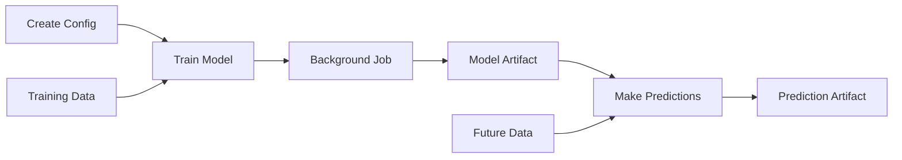

# ML Workflows

Chapkit provides built-in support for machine learning train/predict workflows with three runner types.

## Overview

The ML module enables:

- **Training**: Train models asynchronously and store in artifacts
- **Prediction**: Make predictions using trained models
- **Storage**: Automatic model serialization to artifacts
- **Jobs**: Background execution with status tracking
- **Flexibility**: Three runner types for different needs

## ML Workflow



1. **Create configuration** with model parameters
2. **Train model** with training data → Returns job ID + model artifact ID
3. **Poll job** until training completes
4. **Get model artifact** with serialized model
5. **Make predictions** with model + future data → Returns job ID + prediction artifact ID
6. **Get predictions** from prediction artifact

## Runner Types

### Functional Runner

Simple functions for stateless train/predict:

```python
from chapkit.modules.ml import FunctionalModelRunner

async def on_train(config, data, geo):
    model = LinearRegression()
    model.fit(data[["x"]], data["y"])
    return model

async def on_predict(config, model, historic, future, geo):
    future["prediction"] = model.predict(future[["x"]])
    return future

runner = FunctionalModelRunner(on_train=on_train, on_predict=on_predict)
```

**Use when:**
- Simple stateless logic
- Quick prototypes
- Functional programming style

[Learn more →](functional-runner.md)

### Class-Based Runner

OOP style with shared state and lifecycle hooks:

```python
from chapkit.modules.ml import BaseModelRunner

class MyRunner(BaseModelRunner):
    def __init__(self):
        self.scaler = None

    async def on_train(self, config, data, geo):
        self.scaler = StandardScaler()
        X = self.scaler.fit_transform(data[["x"]])
        model = LinearRegression()
        model.fit(X, data["y"])
        return {"model": model, "scaler": self.scaler}

    async def on_predict(self, config, model, historic, future, geo):
        scaler = model["scaler"]
        X = scaler.transform(future[["x"]])
        future["prediction"] = model["model"].predict(X)
        return future

runner = MyRunner()
```

**Use when:**
- Need shared state (scalers, preprocessors)
- Want lifecycle hooks (init/cleanup)
- Prefer OOP style
- Complex ML pipelines

[Learn more →](class-runner.md)

### Shell-Based Runner

Execute external scripts in any language:

```python
from chapkit.modules.ml import ShellModelRunner

runner = ShellModelRunner(
    train_command="python scripts/train.py --config {config_file} --data {data_file} --model {model_file}",
    predict_command="python scripts/predict.py --config {config_file} --model {model_file} --future {future_file} --output {output_file}",
    model_format="pickle",
)
```

**Use when:**
- Integrating existing scripts
- Language-agnostic workflows (R, Julia, etc.)
- Container-based execution
- External tools/CLI programs

[Learn more →](shell-runner.md)

## Quick Setup

### 1. Define Config

```python
from chapkit import BaseConfig

class MLConfig(BaseConfig):
    learning_rate: float = 0.01
    epochs: int = 100
```

### 2. Create Hierarchy

```python
from chapkit.modules.artifact import ArtifactHierarchy

hierarchy = ArtifactHierarchy(
    name="ml_pipeline",
    level_labels={0: "trained_model", 1: "predictions"}
)
```

### 3. Implement Runner

Choose functional, class-based, or shell-based (see above).

### 4. Build Service

```python
from chapkit.api import MLServiceBuilder, ServiceInfo

app = MLServiceBuilder(
    info=ServiceInfo(display_name="ML Service"),
    config_schema=MLConfig,
    hierarchy=hierarchy,
    runner=runner,
).build()
```

## Data Formats

### Training Data

pandas-compatible JSON format:

```json
{
  "columns": ["feature1", "feature2", "target"],
  "data": [
    [1.0, 2.0, 10.0],
    [2.0, 3.0, 15.0]
  ]
}
```

### Prediction Data

Features only (no target):

```json
{
  "columns": ["feature1", "feature2"],
  "data": [
    [1.5, 2.5],
    [2.5, 3.5]
  ]
}
```

### Optional GeoJSON

```json
{
  "type": "FeatureCollection",
  "features": [
    {
      "type": "Feature",
      "geometry": {"type": "Point", "coordinates": [-122.4, 37.7]},
      "properties": {"name": "Location 1"}
    }
  ]
}
```

## API Endpoints

### Train

```bash
POST /api/v1/ml/$train
```

Request:

```json
{
  "config_id": "01JB...",
  "data": {"columns": [...], "data": [...]},
  "geo": {...}  // optional
}
```

Response:

```json
{
  "job_id": "01JB...",
  "model_artifact_id": "01JB..."
}
```

### Predict

```bash
POST /api/v1/ml/$predict
```

Request:

```json
{
  "model_artifact_id": "01JB...",
  "historic": {"columns": [...], "data": [...]},  // optional
  "future": {"columns": [...], "data": [...]},
  "geo": {...}  // optional
}
```

Response:

```json
{
  "job_id": "01JB...",
  "prediction_artifact_id": "01JB..."
}
```

## Complete Examples

See detailed guides with cURL commands:

- [Complete Examples](examples.md) - Full workflows with sample data

## Next Steps

- [Functional Runner](functional-runner.md) - Simple function-based ML
- [Class-Based Runner](class-runner.md) - OOP ML with state
- [Shell-Based Runner](shell-runner.md) - Language-agnostic ML
- [Complete Examples](examples.md) - End-to-end tutorials
